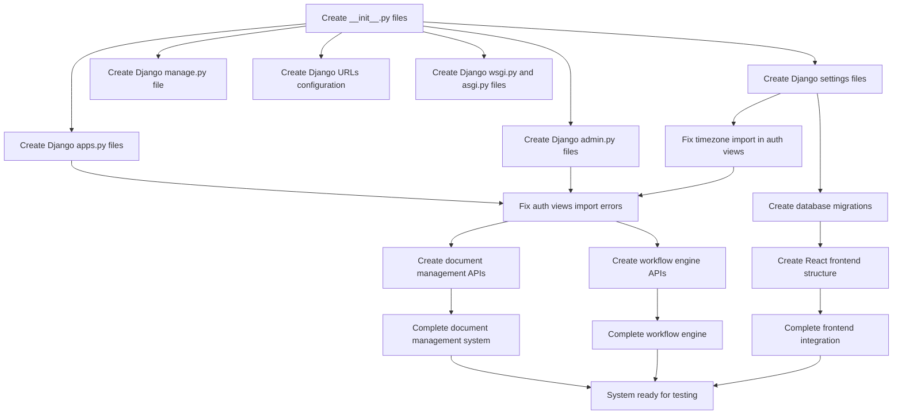

# TODO Resolution Plan - Parallel Execution Strategy

## Analysis Summary

Identified **14 critical TODO items** that need to be resolved for the MOPC platform to be fully functional.

## Dependency Flow Diagram

## Parallel Execution Groups

### Group 1: Foundation (Can be done in parallel)
- Create __init__.py files for all Python packages
- Create Django apps.py files for each app
- Create Django admin.py files for each app
- Create Django settings files (base, development, production, test)
- Create Django manage.py file
- Create Django URLs configuration for main project
- Create Django wsgi.py and asgi.py files

### Group 2: Dependencies (Requires Group 1 completion)
- Fix missing timezone import in authentication/views.py
- Create database migrations and initial data fixtures
- Fix authentication views.py import errors and missing self references

### Group 3: API Development (Requires Group 2 completion)
- Create document management serializers and views
- Create workflow engine serializers and views
- Create React frontend basic structure and components

## Execution Strategy

1. **Phase 1**: Execute all Group 1 tasks in parallel (7 agents)
2. **Phase 2**: Execute Group 2 tasks in parallel (3 agents)
3. **Phase 3**: Execute Group 3 tasks in parallel (3 agents)

This approach maximizes parallelization while respecting dependencies.