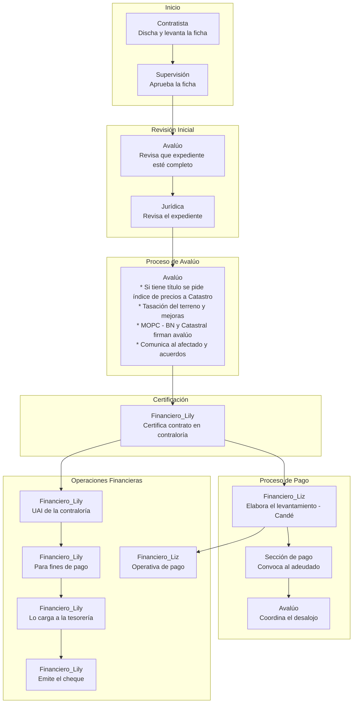

# GOBIERNO DE LA  
## REPÚBLICA DOMINICANA  
### DIRECCIÓN GENERAL ADMINISTRATIVA Y FINANCIERA  

# VÍAS QUE RECORREN ACTUALMENTE LOS EXPEDIENTES DE EXPROPIACIÓN

- 1. **Contratista**
  - Diseña ficha catastral y levantamiento topográfico  
  - Entrega a Viceministerio de Supervisión y Fiscalización  

- 2. **Viceministerio de Supervisión y Fiscalización**
  - Revisa ficha y levantamiento topográfico  
  - Aprueba y remite a Departamento de Avalúos  

- 3. **Departamento de Avalúos** - Leger  
  - Valora inmueble tras confirmar si tiene título (tasación) y elabora informe de avalúo  
  - Notifica propietario (llegan a un acuerdo)  
  - Envía expediente a Departamento Jurídico  

- 4. **Departamento Jurídico (Recepción)** - Peña Conce  
  - Revisa legalidad del expediente **(en qué sentido? Qué agregan)**  
  - Remite a Departamento de Control Interno  

- 5. **Departamento de Control Interno** - ~~Moreira~~ Martina  
  - Verifica cumplimiento normativo y documentación **(qué tipo de documentación)**  
  - Remite a Departamento de Revisión y Análisis  

- 6. **Departamento de Revisión y Análisis** - Edinson  
  - Analiza expediente y validaciones técnicas **(qué exactamente técnico revisan, ficha (el que de la ficha?))**  
  - Emite informe favorable  
  - Remite a Dirección General Administrativo y Financiero  

- 7. **Dirección General Administrativo y Financiero** - Gilberto _todo_  
  - Valida aspectos administrativos y financieros  
  - Autoriza y coordina con Departamento Financiero  
  - Remite a Despacho del Ministro  

- 8. **Despacho del Ministro**  
  - Revisa y firma autorización  
  - Remite a Departamento Financiero  

- 9. **Departamento Financiero** - ~~Jonathan~~ Maria  
  - Recibe expediente autorizado  
  - Programa pago y prepara documentación financiera _(preventivo)_ **Juana**  
  - Envía a Departamento Jurídico para revisión final  

- 10. **Departamento Jurídico** - Peña Conce  
* Revisión legal final y redacción/revisión contrato  
* Envía a Contraloría General de la República  

- 11. **Contraloría General de la República**  
* Certifica contrato o expediente  
* Devuelve expediente certificado a Departamento Financiero  

- 12. **Departamento Financiero (post-certificación)** - Jonathan  
* Revisa expediente certificado  
* Elabora libramiento de pago (Jaime Cano)  
* Envía libramiento a Unidad de Auditoría Interna (UAI)  

- 13. **Unidad de Auditoría Interna (UAI)**  
* Revisa y valida libramiento  
* Remite a Tesorería Nacional  

- 14. **Tesorería Nacional** - Raysa  
* Emite cheque a beneficiario  
* Envía cheque a Sección de Pagos del MOPC  

- 15. **Sección de Pagos del MOPC**  
* Custodia y entrega cheque  
* Recoge acuse de recibo  
* Remite expediente al Departamento de Avalúos  

- 16. **Departamento de Avalúos (Coordinación de Desalojo)** - Leger  
* Notifica entrega del inmueble  
* Coordina desalojo (si aplica)  
* Levanta acta de entrega  
* Archiva expediente y notifica unidades técnicas  

- 17. **Dirección General de RD Vial**  
* Recibe expediente de pagos de expropiaciones gestionados por RD Vial  
* Realiza seguimiento y gestión final correspondiente  

# PROPUESTA DE FUSIÓN Y REORGANIZACIÓN DE DEPARTAMENTOS  
## PARA AGILIZAR PROCESOS ADMINISTRATIVOS  

### Funciones del Departamento de Avalúos  
* **Situación actual:** Realiza la valoración técnica y coordinan el acuerdo.  
* **Propuesta:**  
  - Mantener en Avalúos la valoración técnica.  
  - Transferir la coordinación del desalojo y el acuerdo a una unidad especializada (**Departamento Jurídico**)  
  - Revisión de expedientes antes de ser remitido a Jurídica.  
* **Ventajas:**  
  - Aumenta la especialización de funciones.  
  - Mejora la gestión y seguimiento del desalojo.  

### Departamento Jurídico  
* **Situación actual:** Interviene en dos etapas distintas (recepción/revisión inicial y revisión legal final/redacción de contrato).  
* **Propuesta:** Intervenir en la etapa de redacción del contrato en caso de que en la etapa inicial no se agregue al expediente ningún documento legal.  
* Analista legal en departamento de Control Interno / Revisión y Análisis para verificar aspectos legales.  
* **Ventajas:**  
  - Elimina duplicidades.  
  - Mejora la trazabilidad legal.  
  - Acelera los tiempos de revisión.  

### Centralización del Departamento Financiero  
* **Situación actual:** Participa en la etapa de programación (etapa 9) y vuelve en la post-certificación (etapa 12).  
* **Propuesta:** Implementar una plataforma digital centralizada (como el SIGEF) donde todas las unidades puedan subir, revisar, validar y consultar en tiempo real los documentos.  
* **Ventajas:**  
  - Reduce el traspaso de expedientes.  
  - Mayor continuidad en la gestión financiera.  

### Departamento de Control Interno y Departamento de Revisión y Análisis

* **Situación actual:** Ambos revisan expedientes, uno con enfoque normativo (Control Interno), otro técnico (Revisión y Análisis).  
* **Propuesta:** En vez de que el expediente llegue primero a Control Interno, de ahí se remita a Revisión y Análisis y luego regrese a Control Interno para ser remitido a Administrativo y Financiero, que el expediente llegue directamente a Revisión y Análisis y luego sea remitido a Control Interno.  
* **Ventajas:**  
  - Mejora la coordinación interna.  
  - Evita revisiones duplicadas.  
  - Reduce tiempos de respuesta.  

### Redistribución de Validaciones entre el Despacho del Ministro y Dirección General Administrativo y Financiero y Dirección Financiera

* **Situación actual:** Ambos validan y autorizan actos administrativos y financieros.  
* **Propuesta:** Solo intervenir cuando sea la firma del oficio en conjunto del libramiento. No venir el oficio y posteriormente el libramiento para su firma.  
* **Ventajas:**  
  - Reduce la carga operativa del DGAF.  
  - Aumenta la eficiencia y claridad del proceso de validación.  

### Coordinación entre la Unidad de Auditoría Interna (UAI) y el Departamento de Control Interno

* **Situación actual:** Ambos ejercen funciones de control, pero en niveles distintos.  
* **Propuesta:**  
  - Mantener ambas unidades.  
  - Mejorar la coordinación entre ellas mediante uso de herramientas tecnológicas y flujos integrados (tipo lo propuesto en el área financiera).  
* **Ventajas:**  
  - Se preservan los controles institucionales.  
  - Se evitan cuellos de botella.  

## PRINCIPALES PROBLEMAS DETECTADOS

1. **Duplicidad de funciones entre algunas dependencias (Jurídico, Avalúos, Control Interno, Revisión y Análisis).**  
2. Falta de trazabilidad en tiempo real del estado del expediente.  
3. Dependencia excesiva del papel físico y firmas manuales.  

## PROPUESTAS PARA MEJORAR EL PROCESO

### 1. Digitalización y automatización del expediente de expropiación

* **Propuesta:** Implementar una **plataforma digital centralizada** (tipo sistema de gestión de expedientes o como tenemos en financiero) donde todas las unidades puedan subir, revisar, validar y consultar en tiempo real los documentos.  
* **Beneficios:**  
  - Reducción de tiempos de traslado físico.  
  - Trazabilidad completa del proceso.  
  - Alertas automáticas de pendientes/seguimientos y localización de cada documento.  

### 2. Revisión paralela entre unidades

* **Propuesta:** Cambiar el flujo de revisiones secuenciales por un modelo **paralelo en ciertas fases**, especialmente entre:  
  - Revisión de Control Interno y Revisión y Análisis.  
* **Beneficios:** Ahorro significativo de tiempo sin sacrificar controles.  

### 3. Plantillas y listas de chequeo estandarizadas

* **Propuesta:** Desarrollar formularios digitales únicos y **checklists obligatorios** para cada fase. (como el que me mostró Melyssa que utilizan en control interno) tratar de colocar la firma de quien revisa los expedientes.  
* **Beneficios:** Asegura la calidad de la información y reduce observaciones.  

## 4. Asignación de responsable y tiempos máximos por etapa

* **Propuesta:** Asignar un **responsable directo por etapa** y establecer **plazos máximos de respuesta automáticos**, con alertas para seguimiento.  
* **Beneficios:** Mejora la rendición de cuentas y acelera la toma de decisiones.

## 5. Mesa técnica interdepartamental de seguimiento

* **Propuesta:** Establecer una **mesa técnica mensual (mesa de trabajo)** con representantes de Avalúos, Jurídico, Control Interno, Financiero, y Supervisión para monitorear expedientes en proceso y resolver cuellos de botella.  
* **Beneficios:** Mejora la comunicación y reduce tiempos de espera por aclaraciones o trámites duplicados.

## 6. Integración con entidades externas

* **Propuesta:** Crear convenios de colaboración digital con:  
  - **Dirección Nacional de Catastro**  
  - **Bienes Nacionales**  
* **Beneficios:** Validación más ágil y menos burocrática al final del proceso.

## ¿QUÉ RESULTADOS SE ESPERAN CON ESTAS MEJORAS?

* Reducción de un 30-50% en el tiempo total del proceso.  
* Mayor trazabilidad y control documental.  
* Reducción de errores por duplicidad o mala coordinación.  
* Mejora de la percepción institucional ante los afectados.  
* Uso más eficiente de los recursos públicos.
